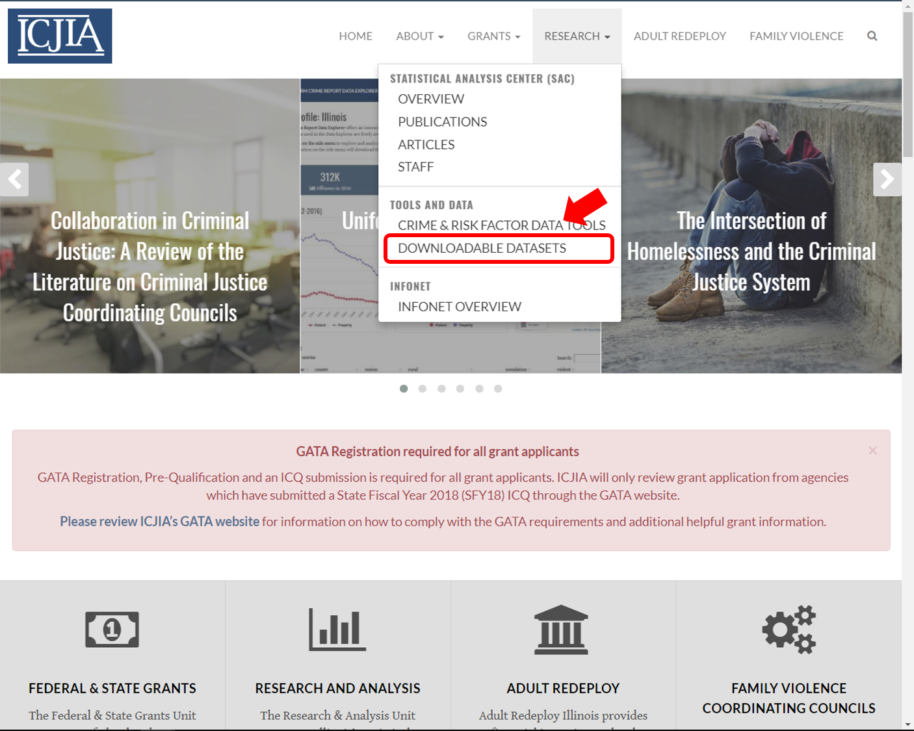
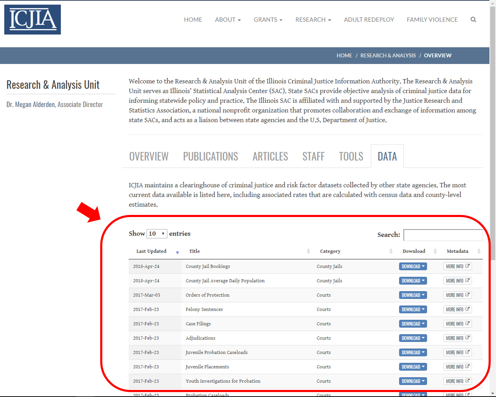
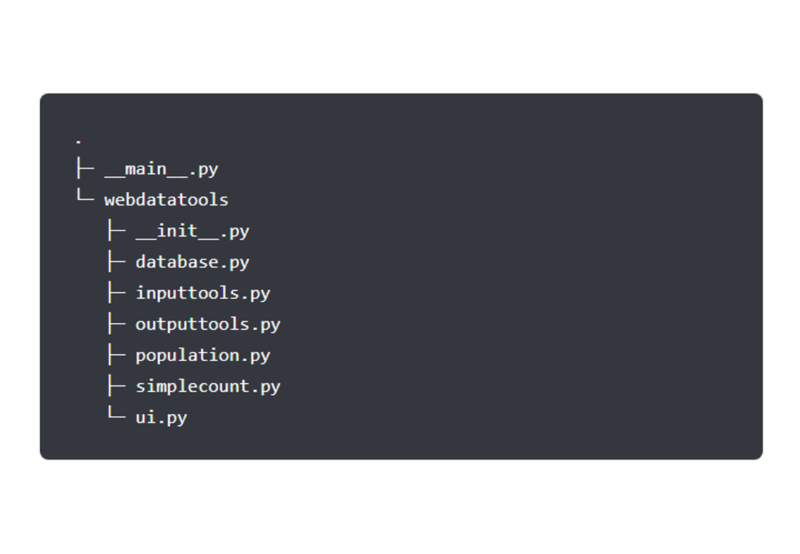
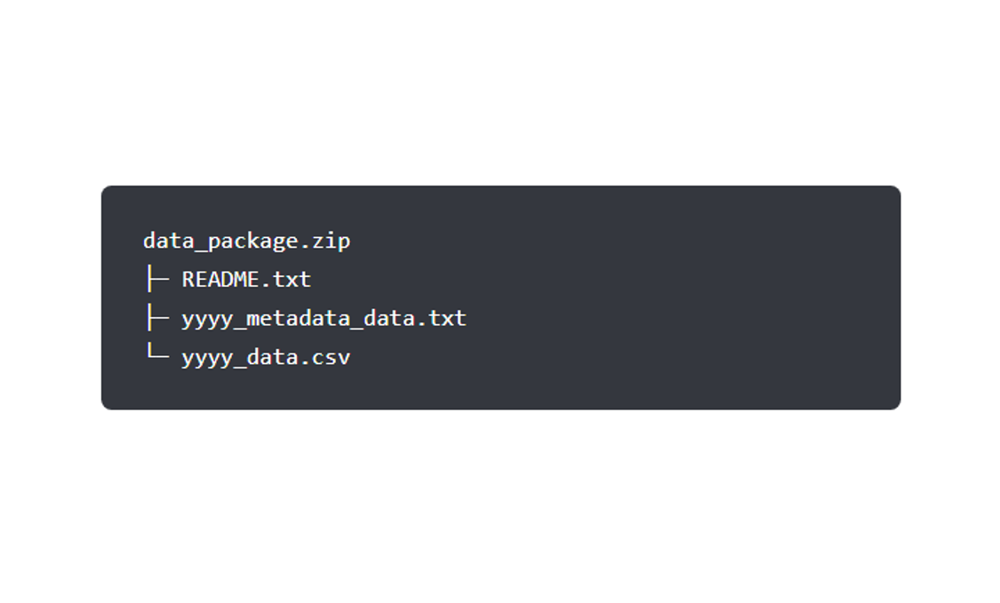
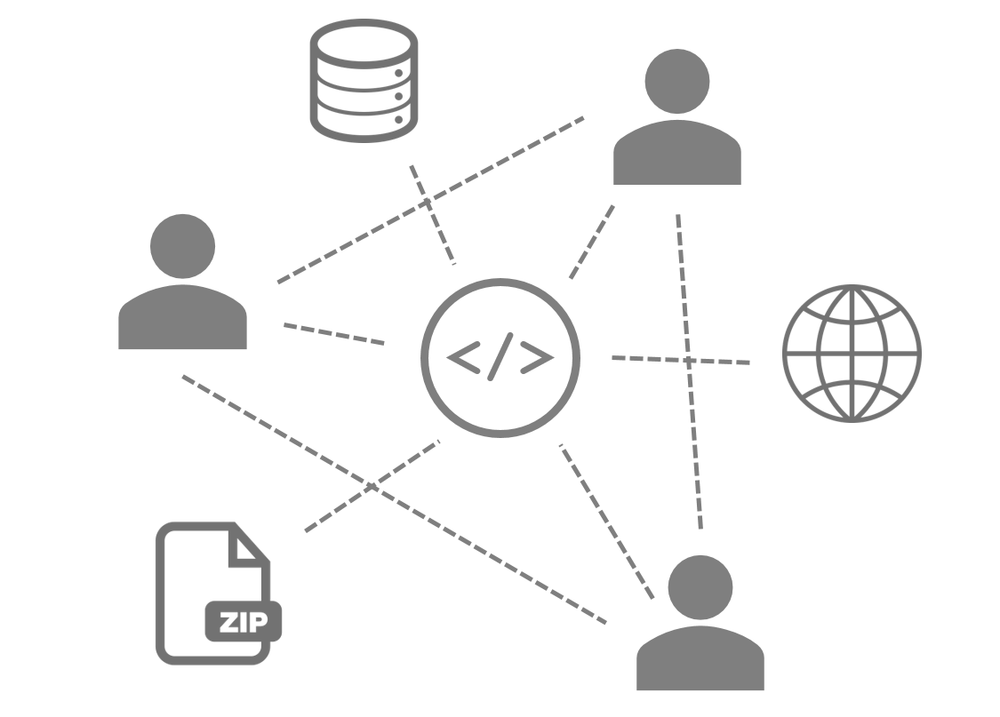
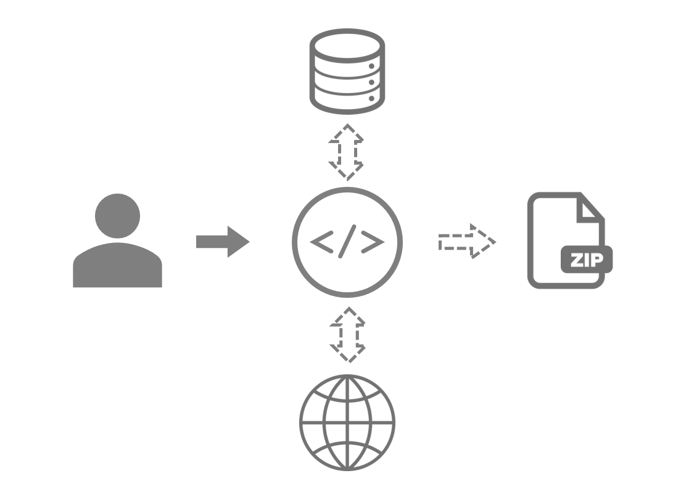
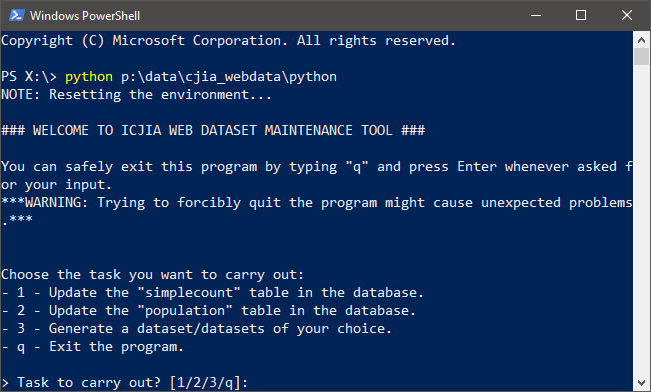
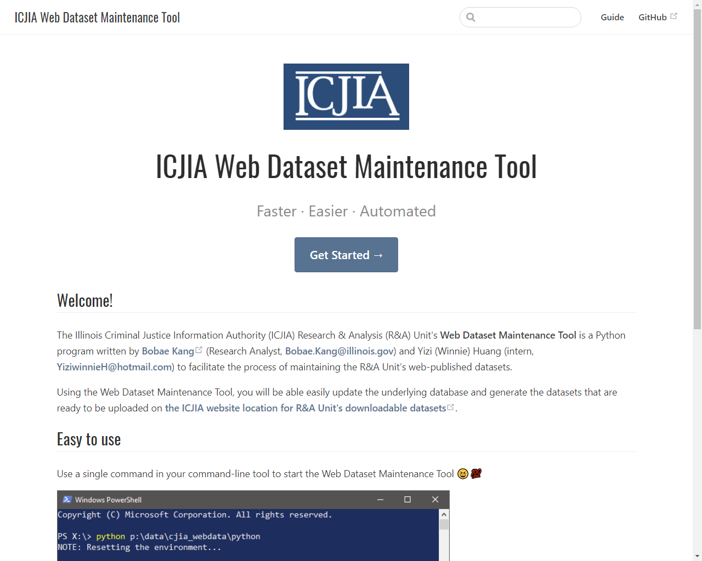

```{r setup, include=FALSE}
library(knitr)

opts_chunk$set(echo=FALSE, warning=FALSE, message=FALSE, python.reticulate=FALSE)
```

## Agenda {data-transition="zoom"}

> * Background
> * Design and Implementation
> * Showcase
> * Path forward

# Background {data-background="#466c8c"}

## {data-transition="concave-in fade-out"}
```{r out.width="70%"}

```

## {data-transition="fade-in concave-out"}
```{r out.width="70%"}

```

##
```{r out.width="75%"}
include_graphics("image/format_1_1.png")
```

##
```{r out.width="75%"}
include_graphics("image/process_old.png")
```

## Motivation
* Time-consuming
* Difficult to maintain
* Suboptimal tools
* Outmoded data format
* Overreliance on a single individual

## Project timeline
| Month | Task |
| --- | --- |
| MAY | Initial planning<br>Inspecting the previous system |
| JUN<br> | Winnie joined the project<br>Designing the DB structure |
| JUL | Implementing the DB structure<br>Building the application |
| AUG | Testing the application<br>Building the documentation site |


# Design and<br>implementation {data-background="#466c8c"}

## What we did
* Automation
* Modular and flexible design
* Fast and efficient tools
* Machine-friendly format
* Potential division of labor

## Automation
```{r out.width="60%"}
include_graphics("https://media.giphy.com/media/3ohuPqvqWs2pFkeure/giphy.gif")
```

## Modularity {data-transition="concave-in fade-out"}
```{r out.width="60%"}

```

## Modularity {data-transition="fade-in concave-out"}
```{r out.width="60%"}

```

## Efficiency
```{r out.width="75%"}

```

## Format (old) {data-transition="concave-in fade-out"}
```{r out.width="75%"}
include_graphics("image/format_1_1.png")
```

## Format (old) {data-transition="fade"}
```{r out.width="75%"}
include_graphics("image/format_1_2.png")
```

## Format (old) {data-transition="fade"}
```{r out.width="75%"}
include_graphics("image/format_1_3.png")
```

## Format (old) {data-transition="fade-in concave-out"}
```{r out.width="75%"}
include_graphics("image/format_1_4.png")
```

## Format (new) {data-transition="concave-in fade-out"}
```{r out.width="75%"}
include_graphics("image/format_2_1.png")
```

## Format (new) {data-transition="fade"}
```{r out.width="75%"}
include_graphics("image/format_2_2.png")
```

## Format (new) {data-transition="fade-in concave-out"}
```{r out.width="75%"}
include_graphics("image/format_2_3.png")
```

## Format (new)
```{r out.width="70%"}

```

## Division of labor {data-transition="concave-in fade-out"}
```{r out.width="60%"}

```

## Division of labor {data-transition="fade-in concave-out"}
```{r out.width="60%"}

```

##
```{r out.width="75%"}

```

# Showcase {data-background="#466c8c"}

##
```{r out.width="70%"}

```

##
<a href="https://bobaekang.github.io/icjia-web-dataset-maintenance-tool/" target="_blank">
```{r out.width="70%"}

```
</a>

# Path forward {data-background="#466c8c"}

# Thank you!